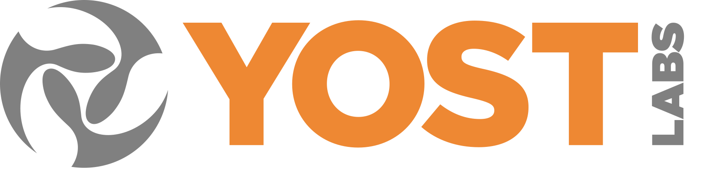
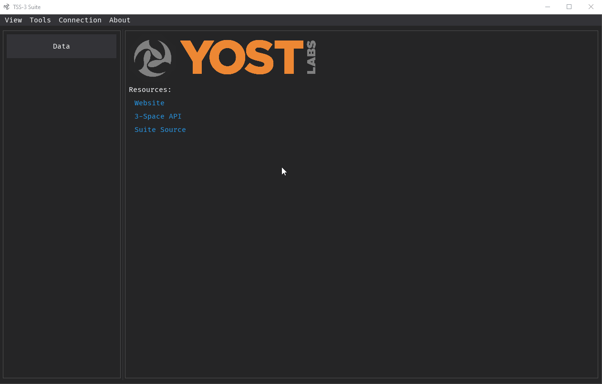
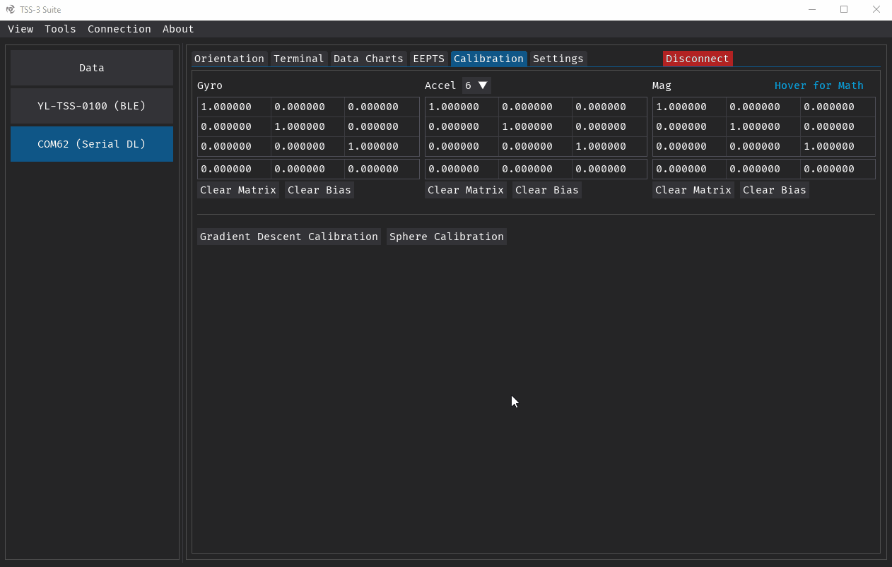
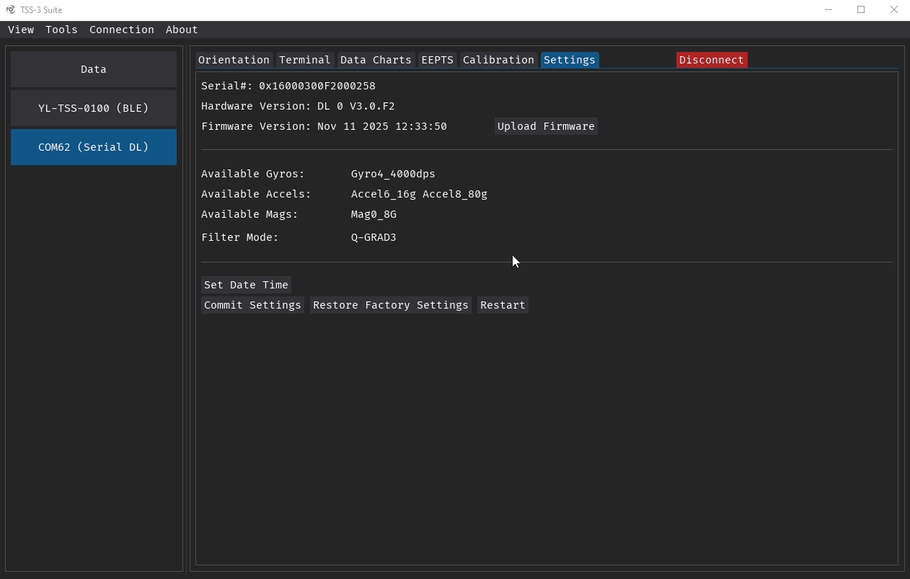

<h1 align="center">
   
  
</h1>

<h3 align="center">Suite Utility for Yostlabs 3.0 Sensors</h4>

 

## Installation
The installer for the most recent version can be downloaded from the [latest release](https://github.com/YostLabs/3SpaceSuite-Python/releases/latest).

Direct Downloads:\
[Windows](https://github.com/YostLabs/3SpaceSuite-Python/releases/latest/download/TSS-3_Suite_Installer.exe)\
More Platforms Soon

## Getting Started
To get started with the suite, simply connect a sensor via USB to your computer, select the sensor on the left, and press **Connect**. You will then have access to multiple tabs to view data from the sensor, communicate with it via a terminal, and perform calibration and updates. Multiple sensors can be connected to at once.

Sensors that support BLE can also be connected wirelessly via the BLE interface if your computer supports BLE and has Bluetooth enabled. The connection interface is shown in parentheses, and multiple interfaces may show up for a single sensor, such as BLE and Serial/USB. For some interfaces, such as Serial, the type of sensor will also be shown in abbreviated form, such as EM for embedded, or DL for Data Logger.

## Common Procedures
### Calibrating Sensors
To calibrate a sensor, first connect to a sensor and then go to its calibration tab. Select **Gradient Descent Calibration**, and follow the steps on the screen. After the process is complete, you should see the Accel and Mag calibration matrices and bias at the top of the window be modified. After calibration, the diagonal of the matrix should have values near 1. If you have values outside the range of 0.85-1.15 you may want to consider recalibrating.

To calibrate the gyroscope, set the sensor on a flat motionless surface and click the **Auto Calibrate Gyros** button. The sensors LED will blink on/off until the process is complete.\
<small>NOTE: At the time of writing, the **Auto Calibrate Gyros** button is in the Orientation tab, but is planned to be moved. Check there if you can not find it.</small>

For the calibration to persist across power cycles, make sure to commit settings by going to the settings tab and pressing the **Commit Settings** button.

For additional calibration information and troubleshooting, check the [calibration](https://github.com/YostLabs/3SpaceSuite-Python/wiki/Calibration) page of the [wiki].

### Updating Firmware
To update the firmware, first connect to a sensor and then go to its setting tab. Select the **Upload Firmware** button and navigate to the *.xml* firmware file to upload. Once selected, the process will begin and shortly complete. At the time of writing, firmware can only be uploaded when connected over a Serial/USB interface.

## Additional Features
Other features include:
* Logging data locally to your device from 1 or more sensors
* Replaying/Viewing gathered data
* EEPTS (Extended Embeded Pedestrian Tracking System)
* Smaller features per window, such as data charts popout

For more information about these features, or how to run the project yourself, view the [wiki]

[wiki]: https://github.com/YostLabs/3SpaceSuite-Python/wiki